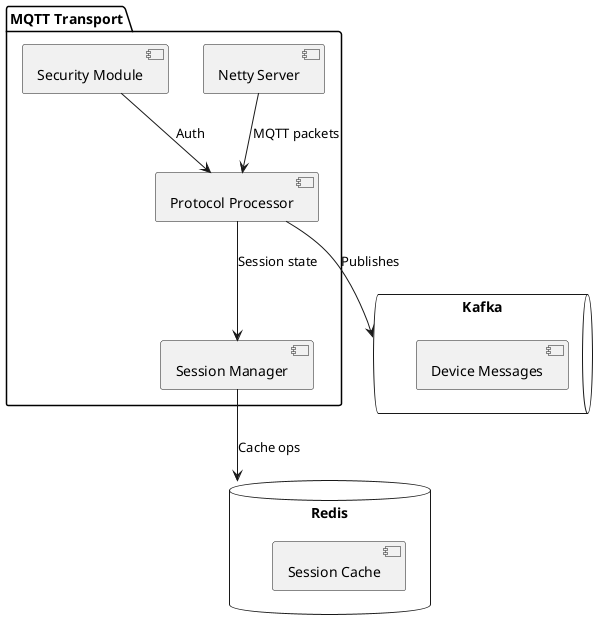

# ThingsBoard MQTT Transport Module Architecture

## Overview
The MQTT transport module is a standalone Spring Boot application that implements the MQTT 3.1.1/3.1 protocol for IoT device connectivity. Key features:
- High-performance Netty-based server
- TLS/SSL encryption support
- Kafka integration for message processing
- Redis-backed session management

## Architectural Diagram


## Core Components

### 1. Netty Server Layer
| Component       | Description                          | Configuration           |
|-----------------|--------------------------------------|-------------------------|
| Boss Group      | Accepts connections (1 thread)      | server.boss_group_size  |
| Worker Group    | Handles I/O operations (12 threads)  | server.worker_group_size|
| SSL Handler     | TLS/SSL termination                  | ssl.enabled             |

### 2. Protocol Processing
```java
// Simplified processing chain
public void channelRead(ChannelHandlerContext ctx, MqttMessage msg) {
    switch (msg.fixedHeader().messageType()) {
        case CONNECT: handleConnect(ctx, (MqttConnectMessage) msg);
        case PUBLISH: handlePublish(ctx, (MqttPublishMessage) msg);
        // ... other message types
    }
}
```

## Communication Flow
1. **Device Connection**:
   ```mermaid
   sequenceDiagram
   participant Device
   participant Netty
   participant Processor
   participant Kafka
    
   Device->>Netty: CONNECT (with credentials)
   Netty->>Processor: Validate packet
   Processor->>Security: Authenticate
   Security-->>Processor: Auth result
   Processor->>Netty: CONNACK
   Netty->>Device: Connection established
   ```

2. **Message Publishing**:
   - QoS 0: Fire-and-forget
   - QoS 1: At-least-once
   - QoS 2: Exactly-once

## Security Mechanisms
| Mechanism       | Implementation                      |
|-----------------|-------------------------------------|
| TLS 1.2+        | Netty SslHandler                    |
| Client Auth     | X.509 certificates                  |
| Rate Limiting   | Token bucket algorithm              |
| ACL             | Device-level publish/subscribe rules|

## Performance Metrics
| Metric          | Value (8-core VM)       |
|-----------------|-------------------------|
| Connections     | 50,000 concurrent      |
| Throughput      | 100,000 msg/sec        |
| Latency         | <10ms (p99)            |

## Deployment Options
1. **Standalone**:
   ```bash
   java -jar tb-mqtt-transport.jar \
     --spring.config.location=file:/etc/thingsboard/conf/mqtt.yml
   ```

2. **Cluster Mode**:
   ```yaml
   # mqtt.yml
   cluster:
     enabled: true
     zookeeper:
       nodes: "zk1:2181,zk2:2181"
   ```

## Troubleshooting Guide
1. **Connection Issues**:
   - Check `logs/mqtt.log` for auth errors
   - Verify port accessibility (1883/8883)
   
2. **Performance Problems**:
   - Monitor Kafka consumer lag
   - Check Redis connection pool stats


# ThingsBoard物联网平台技术架构分析报告

## 一、项目结构概览
```bash
.
├── application/          # 核心应用模块
├── dao/                  # 数据访问层模块
├── transport/            # 传输协议模块（聚合模块）
│   ├── http/             # HTTP协议实现
│   ├── mqtt/             # MQTT协议实现（独立Spring Boot应用）
│   ├── coap/             # CoAP协议实现
│   ├── lwm2m/            # LWM2M协议实现
│   └── snmp/             # SNMP协议实现
├── rule-engine/          # 规则引擎模块
├── common/               # 公共库模块（聚合模块）
│   ├── transport/        # 传输层公共API和实现（聚合模块）
│   │   ├── transport-api # 传输层公共接口
│   │   ├── mqtt/         # MQTT协议核心实现
│   │   └── ...           # 其他协议实现
├── ui-ngx/               # Angular前端模块
├── docker-compose*       # 容器化部署配置
└── pom.xml               # Maven项目配置
```

## 二、核心技术栈

### 1. 后端技术
| 技术/框架        | 版本          | 用途说明 |
|------------------|--------------|---------|
| Java             | 17+          | 基础开发语言 |
| Spring Boot      | 3.2.12       | 核心框架 |
| Spring           | 6.1.21       | 依赖注入和组件管理 |
| Spring Security  | 6.3.9        | 安全认证和权限控制 |
| Netty            | -            | 高性能网络通信框架 |
| Protobuf         | -            | 消息序列化 |
| Apache Kafka     | 3.9.1        | 分布式消息队列 |
| RabbitMQ         | 5.21.0       | 消息中间件 |
| Cassandra        | 4.17.0       | 分布式NoSQL数据库 |
| PostgreSQL       | -            | 关系型数据库 |
| Valkey (Redis)   | -            | 缓存服务 |

### 2. 前端技术
- Angular：主流前端框架，用于构建动态Web应用

### 3. 协议支持
- **物联网协议**：
    - MQTT：轻量级发布/订阅协议
    - CoAP：受限应用协议，适用于低功耗设备
    - LWM2M：轻量级M2M协议
    - SNMP：简单网络管理协议
- **HTTP**：RESTful API交互

### 4. 运维与监控
- Docker Compose：容器化部署
- Prometheus：性能监控
- Grafana：可视化监控仪表盘
- Micrometer：指标收集

## 三、关键模块分析

### 1. 核心启动流程
```java
// 主启动类
@SpringBootApplication
@EnableAsync
@EnableScheduling
public class ThingsboardServerApplication {
    public static void main(String[] args) {
        SpringApplication app = new SpringApplication(ThingsboardServerApplication.class);
        // 添加默认配置参数
        app.setDefaultProperties(Collections.singletonMap("spring.config.name", "thingsboard"));
        ConfigurableApplicationContext context = app.run(args);
        // 记录启动完成事件
        context.publishEvent(new AfterStartUpEvent(context));
    }
}
```

### 2. MQTT传输服务
```java
// MQTT传输服务主类
@SpringBootConfiguration
@EnableAsync
@EnableAutoConfiguration
@ComponentScan(basePackages = {
    "org.thingsboard.server.mqtt",
    "org.thingsboard.server.transport.mqtt",
    "org.thingsboard.server.queue",
    "org.thingsboard.server.cache"
})
public class ThingsboardMqttTransportApplication {
    public static void main(String[] args) {
        SpringApplication app = new SpringApplication(ThingsboardMqttTransportApplication.class);
        app.setMainApplicationClass(ThingsboardMqttTransportApplication.class);
        app.run(args);
    }
}
```

### 3. 网络配置（tb-mqtt-transport.yml）
```yaml
server:
  address: 0.0.0.0
  port: 1883
  ssl:
    enable: false
    key-store: classpath:keystore.jks
    key-store-password: thingsboard
    key-store-type: JKS
    key-alias: tomcat
mqtt:
  netty:
    boss-group-thread-count: 1
    worker-group-thread-count: 12
  session:
    timeout: 600000  # 10分钟超时
  queue:
    per-device-max-size: 100  # 每设备最大队列长度
queue:
  type: kafka
  bootstrap.servers: localhost:9092
cache:
  redis:
    host: localhost
    port: 6379
```

## 四、架构特点

### 1. 微服务架构
- **模块化设计**：清晰的分层架构，各功能模块独立开发和部署
- **独立服务**：MQTT服务作为独立Spring Boot应用运行，可单独部署和扩展
- **服务发现**：通过Kafka和Zookeeper实现服务注册与发现

### 2. 多协议支持
- **协议分离设计**：每种协议作为一个独立模块，便于维护和扩展
- **统一接口**：通过transport-api模块定义统一的传输层接口
- **灵活集成**：支持多种IoT协议（MQTT、CoAP、LWM2M、SNMP等）

### 3. 高性能设计
- **Netty异步IO**：基于Netty的高性能网络通信框架
- **消息队列**：使用Kafka进行异步消息处理，提高系统吞吐量
- **缓存机制**：通过Redis实现分布式缓存，提升数据访问性能

### 4. 安全性
- **SSL/TLS加密**：支持PEM和Keystore两种证书格式
- **认证机制**：设备连接认证和授权
- **速率限制**：支持IP级别的连接限制

## 五、关键流程分析

### 1. MQTT消息处理流程
```
客户端连接 -> SSL/TLS握手 -> 身份验证 -> 主题订阅 -> 消息发布 -> 
  ↓
Netty解码 -> MQTT消息处理器 -> 消息转换为内部格式 -> 
  ↓
消息入队(Kafka) -> 规则引擎处理 -> 数据存储(Cassandra/PostgreSQL)
```

### 2. 设备认证流程
```
客户端连接 -> 发送CONNECT报文 -> 
  ↓
认证拦截器 -> 检查客户端ID/用户名/密码 -> 
  ↓
调用认证服务 -> 查询设备信息 -> 返回认证结果 -> 
  ↓
允许/拒绝连接
```

### 3. QoS处理机制
- **QoS 0**：至多一次交付，直接发送后删除
- **QoS 1**：至少一次交付，发送PUBLISH并保存到本地队列，收到PUBACK后删除
- **QoS 2**：恰好一次交付，四次握手流程：
    1. 发送PUBLISH ->
    2. 收到PUBREC ->
    3. 发送PUBREL ->
    4. 收到PUBCOMP后删除消息

## 六、扩展性和可维护性

### 1. 协议扩展
- 新增协议只需创建新模块并实现transport-api定义的接口
- 示例：添加新的XYZ协议
  ```
  transport/
  └── xyz/
      ├── src/
      │   └── main/
      │       ├── java/org/thingsboard/server/transport/xyz/...
      │       └── resources/tb-xyz-transport.yml
      └── pom.xml
  ```

### 2. 消息队列扩展
- 支持多种消息队列系统（Kafka/RabbitMQ），可通过配置切换
- 扩展新消息队列需实现`QueueService`接口

### 3. 存储扩展
- 支持Cassandra、PostgreSQL等多种数据库
- 可通过DAO模块扩展新的数据存储方式

## 七、部署与运维

### 1. 容器化部署
```yaml
# docker-compose.yml片段
services:
  tb-mqtt:
    image: thingsboard/tb-mqtt-transport:latest
    ports:
      - "1883:1883"
      - "8883:8883"
    environment:
      - SPRING_PROFILES_ACTIVE=prod
      - TB_QUEUE_TYPE=kafka
      - TB_REDIS_HOST=redis
    depends_on:
      - redis
      - kafka
```

### 2. 性能调优建议
- **线程池优化**：根据硬件资源调整Netty的boss/worker线程数
- **批处理优化**：调整消息批处理大小以平衡吞吐量和延迟
- **持久化策略**：根据业务需求选择合适的Cassandra写一致性级别

## 八、待深入分析的关键点

1. **MQTT协议具体实现**：
    - 需要定位Netty ChannelHandler实现类
    - 需要查看Protobuf消息编解码逻辑

2. **规则引擎集成**：
    - 需要研究消息如何从MQTT服务传递到规则引擎
    - 需要分析规则链执行机制

3. **边缘计算支持**：
    - 需要进一步查看edge模块的实现
    - 需要研究边缘设备同步机制

4. **Actor模型应用**：
    - 需要分析common/actor模块的实现
    - 需要了解并发模型的设计

## 九、总结

ThingsBoard是一个功能完整的物联网平台，具有以下显著特点：

1. **全面的技术栈覆盖**：从前端到后端，从协议层到数据存储，提供完整解决方案
2. **优秀的架构设计**：微服务化、模块化、可扩展性强的设计模式
3. **强大的协议支持**：对主流IoT协议的全面支持和良好实现
4. **企业级特性**：包括安全通信、高可用、水平扩展等企业级能力
5. **良好的运维支持**：完善的监控、日志和容器化部署支持

该平台适合作为工业级物联网解决方案的基础，同时也提供了良好的扩展性，可以根据具体需求进行定制和增强。后续的深入分析应重点关注核心协议的具体实现细节以及各个模块之间的交互机制。