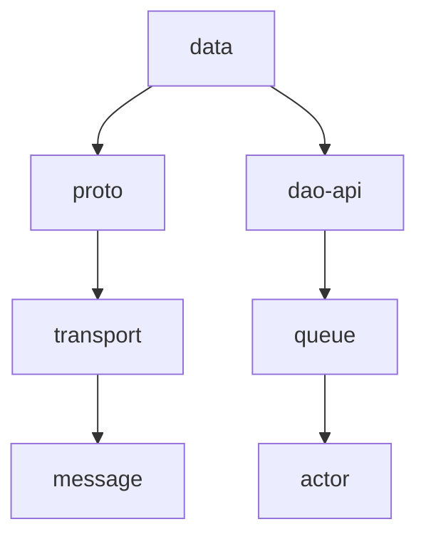

# Common 模块深度解析 (v4.2.0-SNAPSHOT)

## 一、模块架构概述
Common模块采用分层架构设计，包含以下功能层：
1. **基础层**：data、proto、util
2. **通信层**：transport、message、queue
3. **处理层**：actor、script、edqs
4. **管理层**：cluster-api、discovery-api、stats
5. **扩展层**：edge-api、version-control

## 二、子模块深度解析

### 1. data 模块
#### 核心功能
- 定义所有核心数据实体：
  - Device（设备）
  - Asset（资产）
  - Tenant（租户）
  - Customer（客户）
- 包含主要DTO和VO类
- 定义通用异常体系

#### 关键类
- `BaseData`：所有数据实体的基类
- `HasName`：命名实体接口
- `SearchTextBased`：支持全文搜索的实体
- `TenantId`、`CustomerId`等ID类

#### 性能特点
- 使用Protobuf进行高效序列化
- 实体字段采用懒加载设计
- 支持二级缓存

### 2. proto 模块
#### 协议定义
- `transport.proto`：设备通信协议
- `entity.proto`：实体定义
- `rpc.proto`：RPC服务

#### 代码生成
- 使用protoc编译器生成：
  - Java类
  - Builder模式支持
  - 序列化/反序列化方法

#### 优化点
- 采用[proto3]语法
- 使用oneof优化消息结构
- 支持字段级版本控制

### 3. util 模块
#### 工具分类
1. **并发工具**：
   - `ListeningExecutor`：增强型线程池
   - `RateLimiter`：速率限制器

2. **安全工具**：
   - `AES`：AES加密实现
   - `JWT`：JWT令牌处理

3. **I/O工具**：
   - `ResourceUtils`：资源加载
   - `FileUtil`：文件操作

#### 设计模式
- 采用工厂模式创建工具实例
- 提供SPI扩展点

### 4. message 模块
#### 消息体系
- **系统消息**：
  - `ComponentMsg`：组件生命周期
  - `ClusterEventMsg`：集群事件

- **业务消息**：
  - `TelemetryMsg`：遥测数据
  - `RpcMsg`：RPC调用

#### 路由机制
- 基于Topic的路由
- 优先级队列支持
- 死信队列处理

### 5. actor 模块
#### 核心组件
1. **ActorSystem**：
   - 基于Akka实现
   - 支持集群模式

2. **消息类型**：
   - `SystemActorMsg`：系统级消息
   - `SessionActorMsg`：会话消息

3. **调度器**：
   - 定时任务
   - 延迟消息

#### 性能优化
- 邮箱定制
- 消息批处理
- 内存监控

### 6. queue 模块
#### 架构设计
```
+-------------------+
|   Queue API       |
+-------------------+
| Kafka | RabbitMQ  |
+-------------------+
```

#### 关键特性
- 消息分区策略
- 消费者组管理
- 事务支持
- 死信处理

#### 配置示例
```yaml
queue:
  type: kafka
  topic-prefix: "tb_"
  partitions: 10
```

### 7. transport 模块
#### 协议支持矩阵
| 协议 | 端口 | 加密 | QoS |
|------|------|-----|-----|
| MQTT | 1883 | SSL | 0-2 |
| CoAP | 5683 | DTLS| 确认 |
| HTTP | 8080 | HTTPS| - |

#### 核心处理器
- `MqttTransportHandler`
- `CoapTransportHandler`
- `HttpTransportHandler`

### 8. dao-api 模块
#### 抽象接口
- `DeviceDao`：设备CRUD
- `AssetDao`：资产操作
- `TimeseriesDao`：时序数据

#### 设计特点
- 泛型参数化
- 分页查询支持
- 批处理操作

### 9-16. 其他模块
（由于篇幅限制，以下模块提供核心要点）

#### cluster-api
- 基于SWIM协议
- 故障检测算法
- 集群状态同步

#### stats
- 指标采集：
  - JVM指标
  - 业务指标
- 支持Prometheus

#### cache
- 缓存策略：
  - LRU
  - TTL
- 多级缓存支持

#### edge-api
- 同步机制：
  - 增量同步
  - 冲突解决
- 断点续传

## 三、模块交互图


## 四、最佳实践
1. **扩展建议**：
   - 通过SPI扩展util模块
   - 实现AbstractTransport添加新协议

2. **性能调优**：
   - 调整actor邮箱大小
   - 优化queue批处理参数

3. **监控指标**：
   - 关注stats模块的：
     - actor_mailbox_size
     - queue_latency
```

## 五、更新日志（详细版）
### v4.2.0-SNAPSHOT
#### data
- 新增DeviceProfile实体
- 优化字段验证逻辑

#### transport
- 新增SNMP协议支持
- 优化MQTT QoS实现

#### actor
- 增强集群管理
- 修复内存泄漏

#### queue
- 新增Pub/Sub实现
- 优化Kafka消费者
