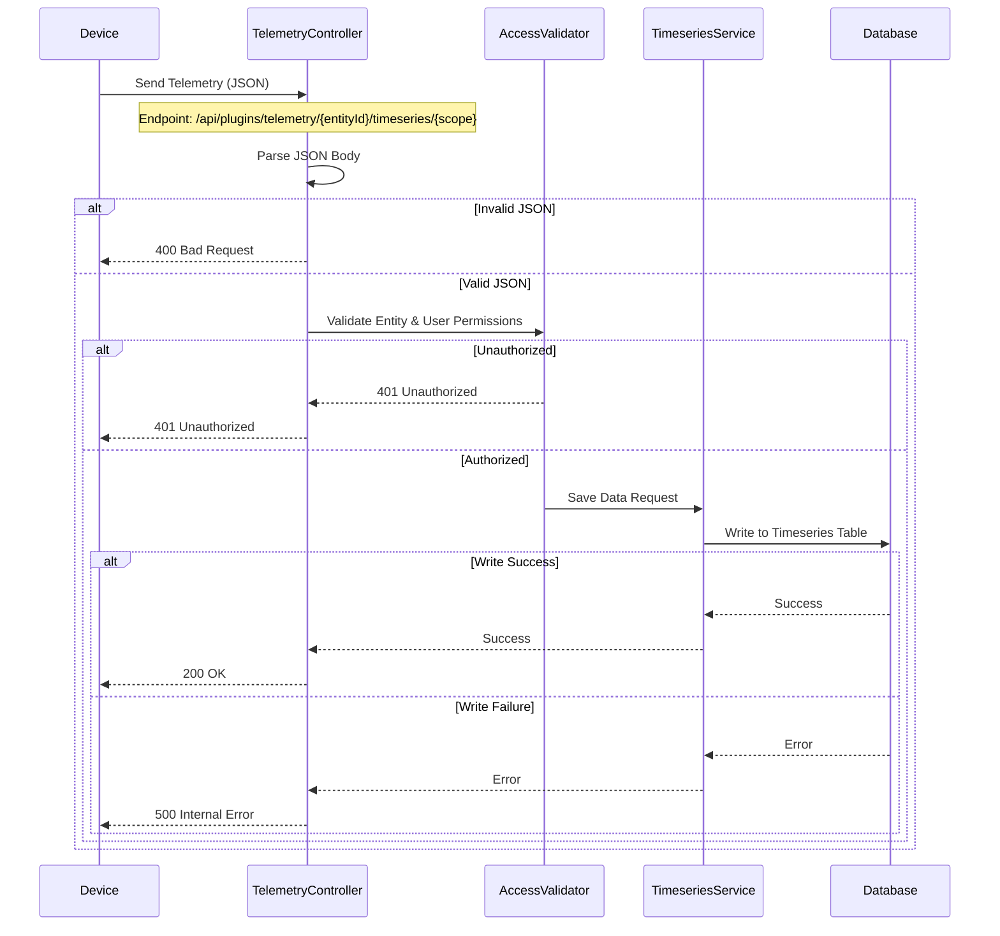
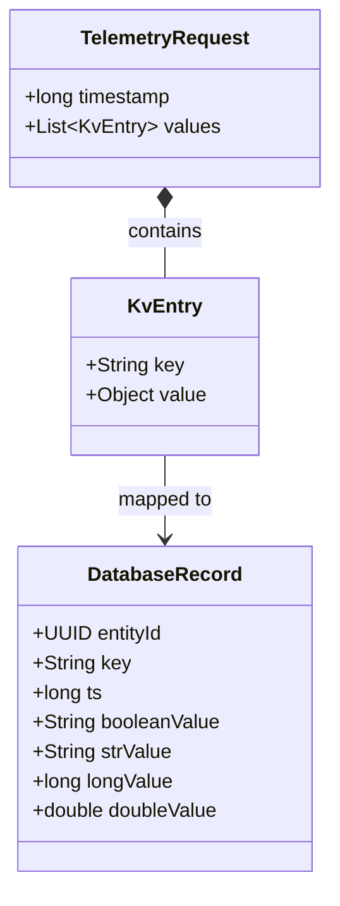

# Device Connectivity & Telemetry Flow

This document explains how devices (sensors, gateways, etc.) connect to the ThingsBoard platform and send data. It details the journey of a data packet from the physical device to the database, ensuring you understand the checkpoints and logic applied along the way.

## 1. The Device Journey (Client Side)

Imagine a weather station measuring wind speed. It needs to send this data to the cloud. We use a protocol called **MQTT** (Message Queuing Telemetry Transport), which is lightweight and perfect for IoT.

### The Simulation Script (`mqtt-send-telemetry.py`)

The project includes a Python script that simulates a device. Here is the logic flow:

```mermaid
flowchart TD
    A([Start Script]) --> B[Initialize MQTT Client]
    B --> C{Connect to Broker}
    C -- Success --> D[Loop 5 Times]
    C -- Fail --> E([Exit/Retry])

    D --> F[Generate Random Data]
    F --> G[Format as JSON]
    G --> H[Publish to 'v1/devices/me/telemetry']
    H --> I[Wait 0.1s]
    I --> D

    D -- Done --> J([End Script])

    subgraph "Data Packet"
    G -- Example Payload --> K(wc: {"windSpeed": "45"})
    end
```

**Key Takeaways for PMs:**
- **Protocol:** Uses MQTT (standard for IoT).
- **Topic:** Sends data to a specific "mailbox" address: `v1/devices/me/telemetry`.
- **Format:** Data is sent as a JSON object (Key-Value pairs).

---

## 2. Platform Processing (Server Side)

Once the message reaches the server, the `TelemetryController` takes over. This is the "Front Desk" of the application that decides if the data is allowed in.

### The Ingestion Flow (`TelemetryController.java`)

When the platform receives a `POST` request (or MQTT message translated to an internal event), the following logic executes:



### Logical Validation Steps

Before saving any data, the system performs rigorous checks:

1.  **Identity Verification**: "Who are you?"
    - The `entityId` (Device ID) must exist in the database.
    - The user (or device credentials) making the request must have permission to write to this specific device.

2.  **Data Integrity**: "Is the data readable?"
    - The payload must be valid JSON.
    - It must contain Key-Value pairs (e.g., `temperature: 25`).
    - Empty payloads are rejected.

3.  **Storage Policy**: "How long do we keep this?"
    - If a `TTL` (Time To Live) is specified, the database is instructed to auto-delete the data after X seconds.
    - If not, it uses the Tenant's default policy (e.g., keep data for 6 months).

---

## 3. Data Structure Visualization

Understanding how data is stored helps in designing dashboards.



- **Key**: The name of the data point (e.g., "batteryLevel").
- **Value**: The reading (e.g., 85).
- **Timestamp**: When the reading happened (in milliseconds).

---

## Summary for Product Managers

- **Connectivity is Robust**: The system handles connection failures and rejects bad data automatically.
- **Security is Built-in**: Every single data packet is checked against user permissions. You cannot write data to a device you don't own.
- **Flexibility**: The system supports any kind of data (numbers, strings, booleans) without needing database schema changes beforehand.
