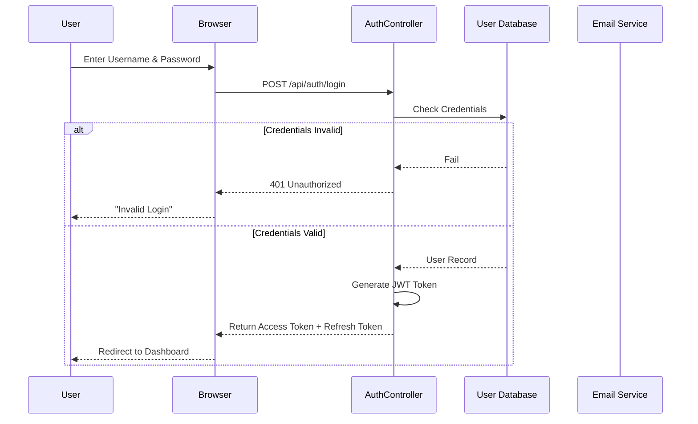
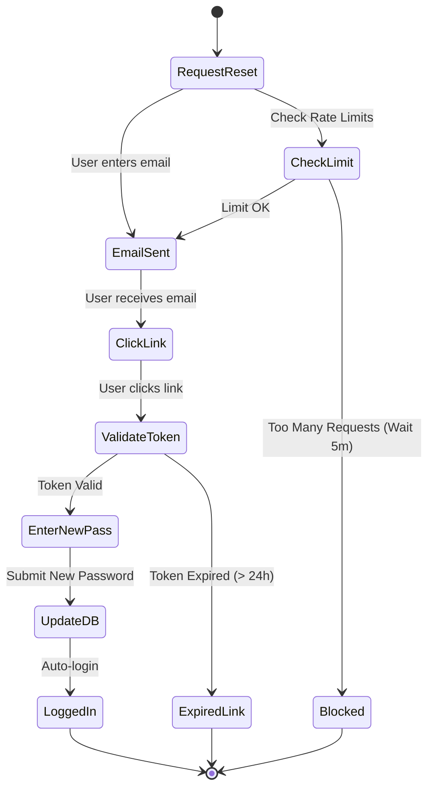
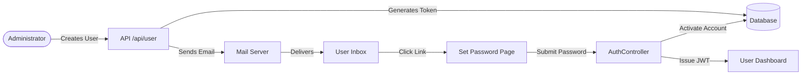
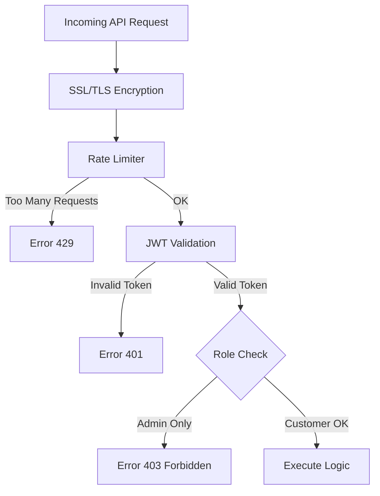

# User Authentication & Security

This document outlines how the system manages user identity, ensuring only authorized personnel can access and modify sensitive data. It details the login, password management, and security protocols in place.

## 1. The Gatekeeper: Authentication Flow

When a user tries to access the platform (e.g., via the Web UI or API), they must first prove their identity. We use **JWT (JSON Web Token)** for this purpose. This means once you log in, you get a digital "badge" that grants you access for a limited time.

### Login Sequence (`AuthController.java`)

**Key Takeaways for PMs:**
- **Stateless:** The server doesn't "remember" logged-in users. It trusts the "Badge" (JWT) presented by the user.
- **Refresh Token:** If the badge expires (e.g., after 1 hour), the refresh token allows getting a new badge without re-entering the password.
- **Security:** Passwords are never stored in plain text. Only their encrypted "hashes" are saved.

---

## 2. Recovering Access: Password Reset Flow

Forgetting passwords happens. The system has a secure, multi-step process to allow recovery without compromising security.

### The Reset Logic

### Security Checkpoints
1.  **Rate Limiting**: To prevent spam attacks, a user can only request a reset email X times per hour (Default: 5).
2.  **Token Expiration**: The link sent in the email is only valid for a specific period (e.g., 24 hours).
3.  **Invalidation**: Once used, the token is immediately destroyed so the link cannot be reused.

---

## 3. Account Activation

When an administrator creates a new user, the user receives an activation email instead of a password.

## 4. API Security Layers

Beyond just logging in, every single API call goes through layers of defense:

**Key Terminology:**
- **SSL/TLS**: Encrypts data in transit (lock icon in browser).
- **Rate Limiter**: Prevents "Denial of Service" attacks by slowing down aggressive users.
- **Role Check**: Ensures a "Customer" cannot delete an "Admin".
