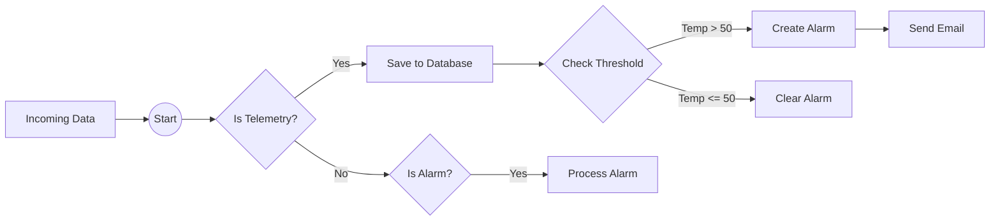
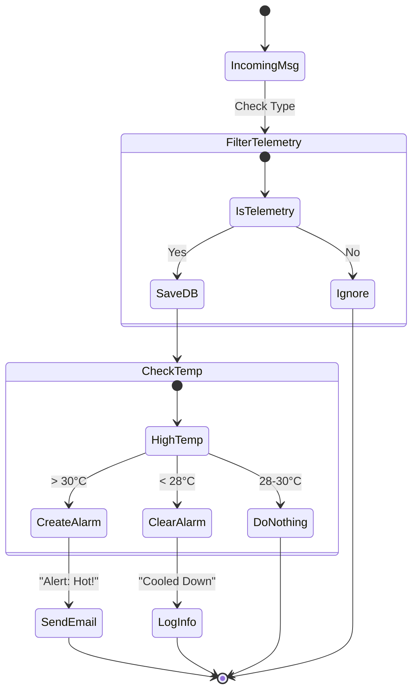
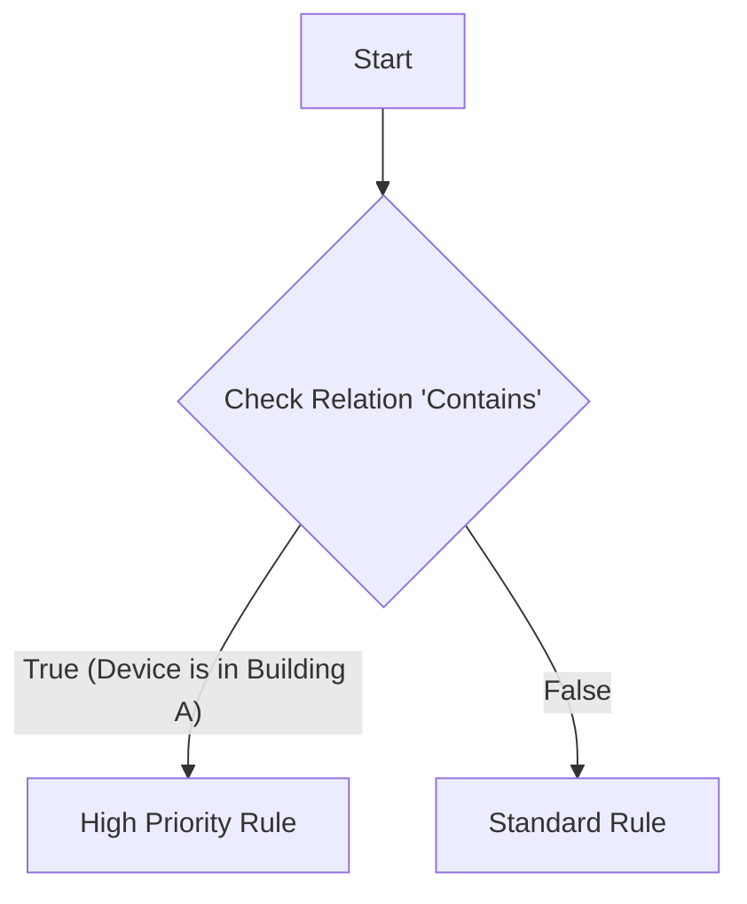

# Rule Engine: The Brain of the IoT Platform

The Rule Engine is the decision-making core of the platform. It allows non-technical users to define logic like "If temperature > 50, send an email" without writing code.

## 1. High-Level Concept

Think of the Rule Engine as a flowchart that every incoming data packet must travel through.

- **Input**: A message from a device (e.g., `{"temp": 55}`).
- **Rule Chain**: A series of connected "nodes" (steps).
- **Node**: A single action (Filter, Transform, Save, Alert).
- **Output**: The result (Email sent, Alarm created, Data saved).

### How It Works

---

## 2. Key Components (Nodes)

The Rule Engine consists of drag-and-drop components. Here are the most critical ones found in the codebase:

### A. Filters (The Gatekeepers)

These nodes decide "Who goes where?" based on the message content.

- **Message Type Filter (`TbMsgTypeFilterNode`)**: Sorts messages. Is it a "Post Telemetry" request? Or an "Attribute Update"?
- **Javascript Filter (`TbJsFilterNode`)**: Allows custom logic.
  - *Example:* `return msg.temperature > 40;`
- **Originator Type Filter (`TbOriginatorTypeFilterNode`)**: Checks who sent the message. Was it a Device? A User? An Asset?

### B. Actions (The Doers)

These nodes perform tasks when triggered.

- **Create Alarm (`TbCreateAlarmNode`)**: Opens a new incident if one doesn't exist.
  - *Use Case:* "High Engine Heat" alarm.
- **Clear Alarm (`TbClearAlarmNode`)**: Closes an incident when conditions return to normal.
  - *Use Case:* Engine cools down below 40 degrees.
- **Save Timeseries (`TbSaveToCustomCassandraTableNode` / Native)**: Persists the data to the database for history graphs.
- **Log (`TbLogNode`)**: Writes to the system log for debugging.

### C. External Integrations

- **Send Email / SMS**: (Often handled via `TbSendEmailNode` or external rule nodes).
- **Kafka / RabbitMQ / MQTT**: Forward data to external systems for analytics.

---

## 3. Real-World Example: Smart Thermostat Logic

Let's visualize a standard "Smart Home" rule chain.

**Objective:**
1. Save all temperature data.
2. If temperature > 30°C, trigger a "High Temp" alarm.
3. If temperature drops below 28°C, clear the alarm.

## 4. Complex Flows: Relation Checks

Sometimes, a rule depends on relationships. For example, "Only apply this rule if the Device belongs to Building A."

**Node: Check Relation (`TbCheckRelationNode`)**

## Summary for Product Managers

- **Visual Logic**: The Rule Engine transforms complex code (`if/else`) into visual diagrams.
- **Real-Time**: Logic is applied *instantly* as data arrives.
- **Scalable**: You can have different chains for different Tenants or Device Profiles.
- **Extensible**: Developers can write custom Nodes (Java) if the built-in ones aren't enough.
